# VM and ACR Integration for Storage

A production-ready deployment workflow demonstrating Azure Virtual Machine (VM), Azure Container Registry (ACR), and Azure Blob Storage integration on Microsoft Azure.

---

## 📌 Architecture & Overview

This project implements an end-to-end integration architecture:
1. **Azure Container Registry (ACR):** Hosts private Docker container images.
2. **Azure Blob Storage:** Manages centralized, decoupled application configurations (`config.json`).
3. **Azure Virtual Machine:** Hosts the container runtime environment (Docker), pulls images from ACR, and interacts with configurations to serve incoming web traffic on port 80.

---

## 🛠 Tech Stack
* **Cloud Platform:** Microsoft Azure (Virtual Machines, Container Registry, Blob Storage, Virtual Network / NSG)
* **Operating System:** Ubuntu 24.04 LTS
* **Containerization:** Docker Engine
* **Tooling & Protocols:** Azure CLI, SSH, SCP, Bash
* **Application Framework:** Python / Flask

---

## 🚀 Step-by-Step Implementation & Proof of Work

### 1. Generating SSH Key Pair Locally
Generated an RSA key pair (`id_rsa` / `id_rsa.pub`) on the management client to enable secure, passwordless authentication for the target virtual machine.
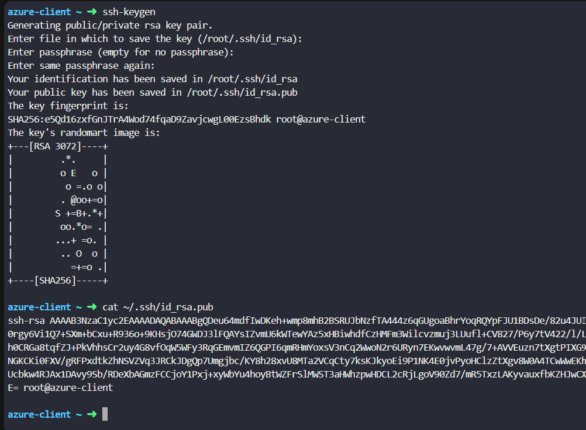

---

### 2. Provisioning the Virtual Machine (Azure Portal)
Configured and launched an Ubuntu 24.04 VM (`datacenter-vm`) in the `East US` region, assigning the generated public key and allowing inbound traffic on ports `22` (SSH) and `80` (HTTP).
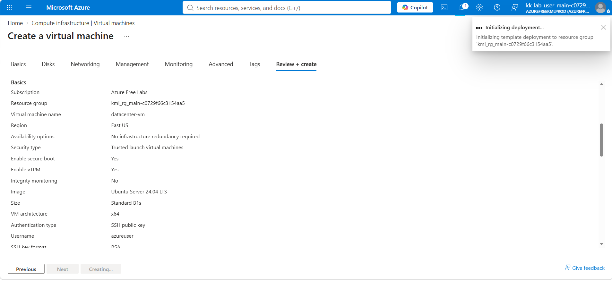

---

### 3. Creating the Azure Container Registry (ACR)
Created a private container registry (`datacenteracr13114`) with the `Basic` SKU to securely manage and store custom container images. Enabled admin credentials for seamless integration.
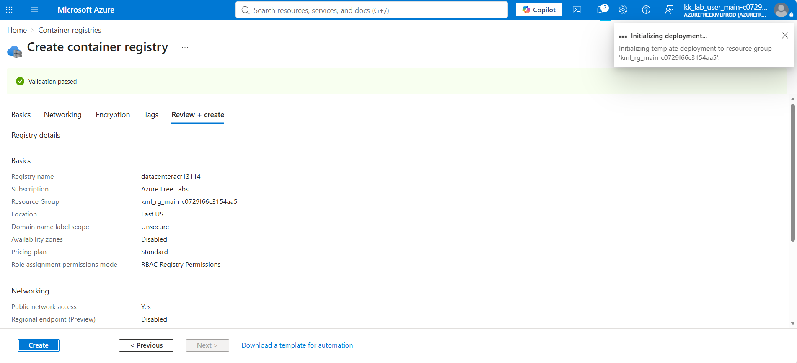

---

### 4. Setting Up Azure Blob Storage
Deployed an Azure Storage Account (`datacenterstor13114`) using `Standard_LRS` (Locally-Redundant Storage) and configured a Blob Container (`datacenter-config`) to decouple static application configuration from compute infrastructure.
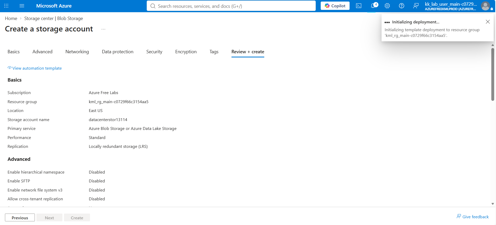

---

### 5. Building the Docker Image Locally
Built the Python Flask container image directly on the developer workstation from the source repository under `/root/pyapp`, packaging all application dependencies.
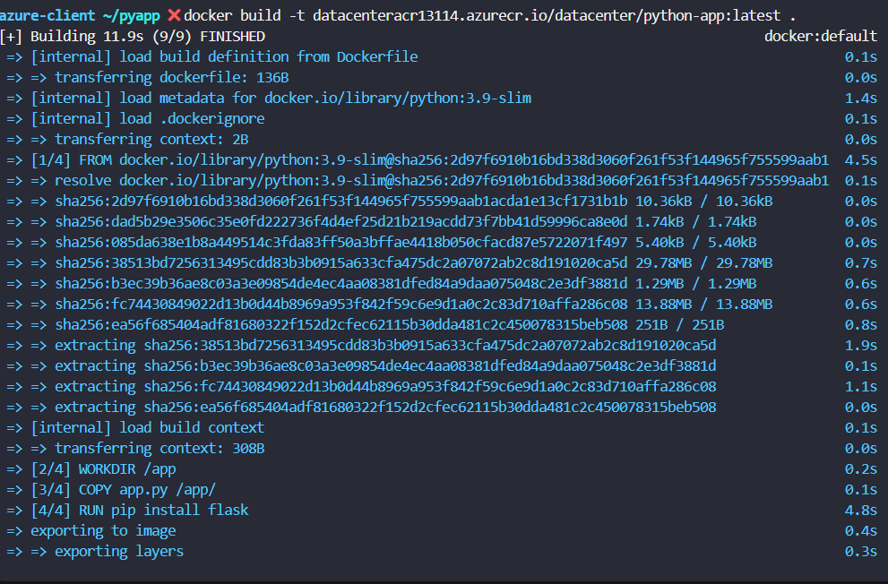

---

### 6. Pushing the Container Image to ACR
Authenticated locally with the Azure Container Registry and pushed the tagged image (`datacenter/python-app:latest`) to the private registry repository.
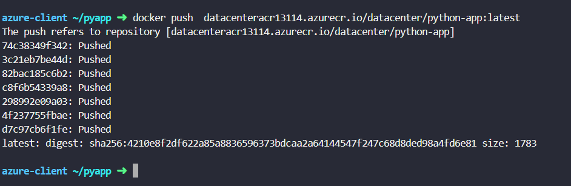

---

### 7. Verifying ACR Artifacts in Azure Portal
Navigated to the Azure Portal to confirm that the repository `datacenter/python-app` and the `latest` image manifest were successfully uploaded and indexed.
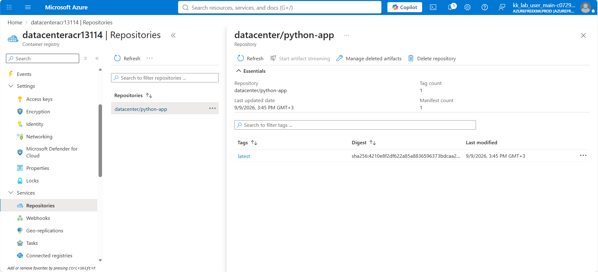

---

### 8. Accessing the Virtual Machine via SSH
Connected remotely to the public IP address of the provisioned Azure VM over SSH using the previously registered public key.
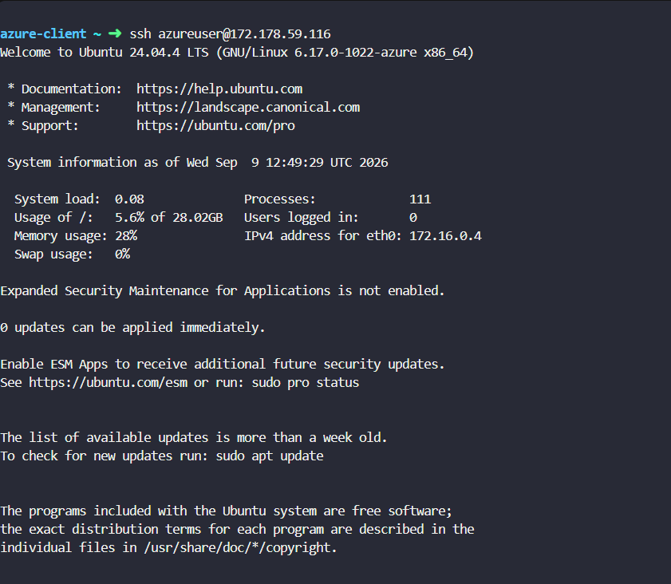

---

### 9. Installing Docker Engine on the VM
Updated package indices and installed `docker.io` on the Ubuntu host to provide the container runtime environment.
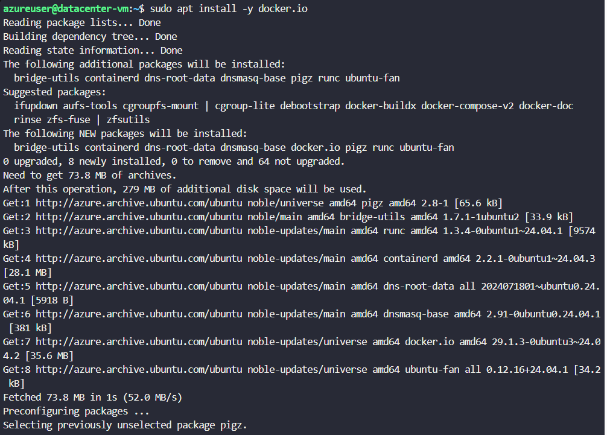

---

### 10. Installing Azure CLI on the VM
Installed the Azure CLI toolchain using the official Microsoft deployment script to allow direct resource manipulation and authentication from the server environment.
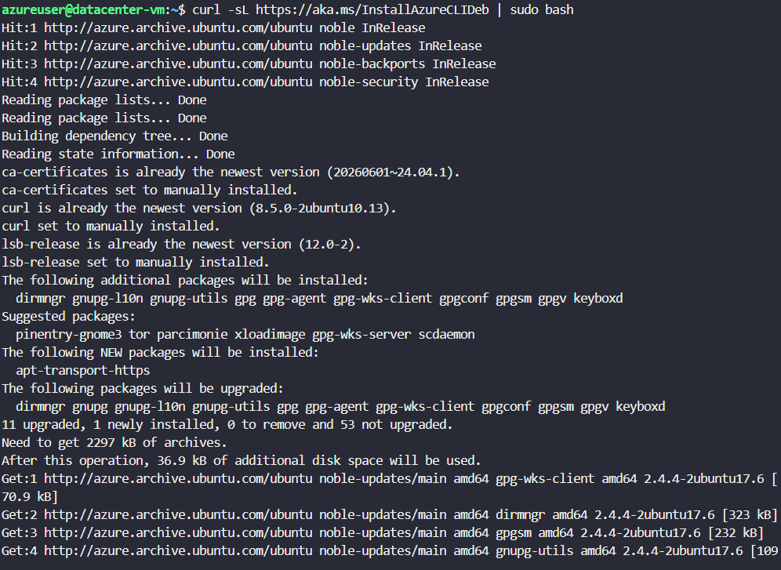

---

### 11. Enabling Services & Post-Installation Setup
Configured system services by starting and enabling the Docker daemon (`systemctl enable --now docker`), added the administrative user to the `docker` usergroup, and validated CLI installations (`az version`).
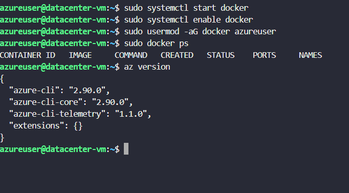

---

### 12. Authenticating Docker with ACR on the Host
Authenticated the VM Docker daemon against the private Azure Container Registry using the verified admin credentials.
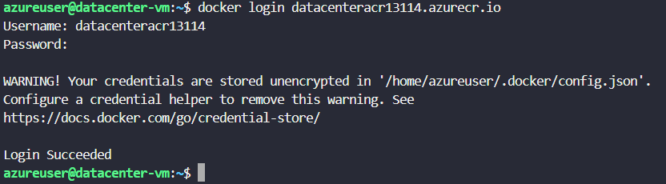

---

### 13. Running Container with Dynamic Volume Mount
Transferred `config.json` to the VM host and executed the container with port forwarding (`80:80`). Mounted the host configuration file into the container at `/app/config.json` to satisfy dynamic runtime dependencies.
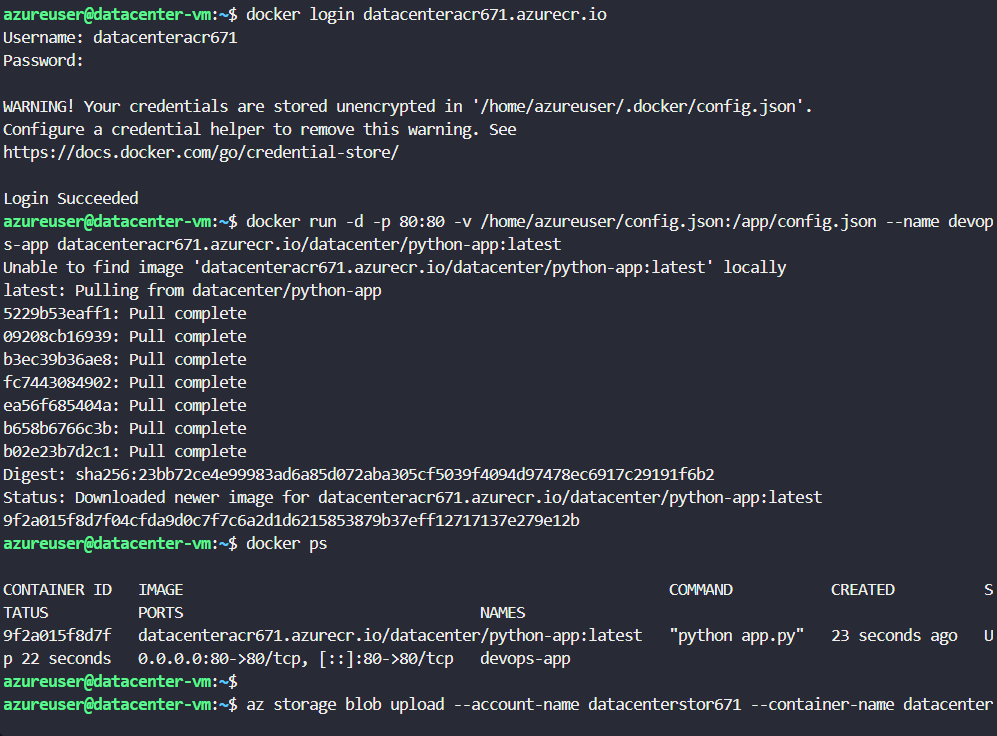

---

### 14. Application Verification & End-to-End Testing
Queried the VM's Public IP through a web browser on port 80. Verified that the containerized application successfully parsed the mounted configuration payload and returned an active response:

```json
Welcome to KKE Azure Labs: {'key': 'value', 'version': 1}